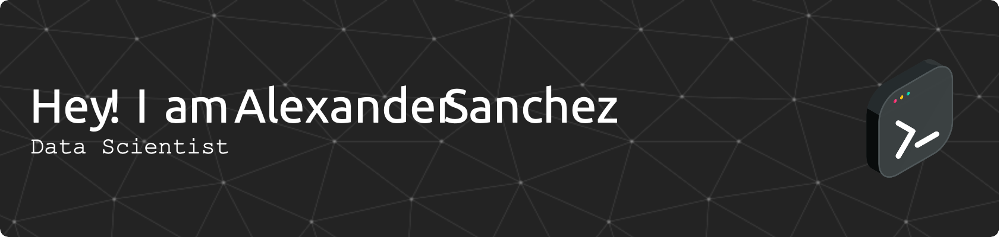

# Hi there, I'm Alexander 👋 | Data Scientist & Quantum Computing Enthusiast

🔭 I'm a Data Science student at the Superior School of Computer Science (**ESCOM – IPN**), Mexico City, with a solid background in computer science and a deep love for **algorithms, quantum machine learning, and data science**. My main focus is **quantum computing**, where I bridge classical ML and quantum methods to tackle real-world problems.

- 🧪 **Currently working on** my undergraduate thesis (*Trabajo Terminal*): a **quantum-classical hybrid pipeline for breast cancer prediagnosis**, using QML, Qiskit, and PyTorch — with quantum-kernel evaluation metrics (KTA, Geometric Difference).
- 🌱 **Learning & exploring** quantum embeddings, kernel methods, and scalable ML pipelines.
- 🎯 **Goal:** pursue quantum computing research through a European master's program, followed by a PhD.
- 🤝 **Open to** collaborations in QML, data science, and research-oriented projects.
- ⚡ **Fun facts:** I'm into cosmology & astronomy

---

## 🧠 Tech Stack

### 💻 Programming Languages

### ⚛️ Quantum Computing

-EE4C2C?style=for-the-badge&logo=pytorch&logoColor=white)

### 🤖 Machine Learning & Deep Learning

### 🗄️ Data Engineering & Big Data

-E25A1C?style=for-the-badge&logo=apachespark&logoColor=white)

### 📊 Data Visualization

### 🛠️ Tools

---

## 🚀 Featured Projects

| Project | Description | Tech |
|---|---|---|
| **⚛️ Quantum-Classical Hybrid Pipeline (Thesis)** | Breast cancer prediagnosis combining quantum machine learning with classical deep learning. Includes quantum embedding evaluation via KTA and Geometric Difference metrics. | `Qiskit` · `PyTorch` · `QML` |
| **🩺 Deep Learning for Mammography** | Classification on the CBIS-DDSM dataset, implemented under a NumPy-only constraint to understand the math from the ground up. | `NumPy` · `Deep Learning` |
| **🎉 Qiskit Fall Fest 2025** | Organized IPN's edition of the global Qiskit Fall Fest — talks, workshops, and a hackathon introducing students to quantum computing. | `Qiskit` · `Community` |
| **🚇 Big Data with PySpark** | Distributed processing practices on real datasets (Metro CDMX, Adult Income) exploring scalable data pipelines. | `PySpark` · `Big Data` |

> 📌 *Pin these repos on your profile and link them here so visitors can dive straight in.*

---

## 🏛️ Leadership & Experience

- 🧑‍🏫 **Co-lead** of the **Tukey Data Science Club** at IPN.
- ⚛️ **Organizer** of **Qiskit Fall Fest 2025**.
- 💼 **Global Technical Sales Intern @ IBM México** (Future Club program).
- 📈 **Former Data Intern @ Polipay** — ETL pipelines and Power BI dashboards.

---

## 📊 GitHub Stats

---

## 🤝 Connect with me

